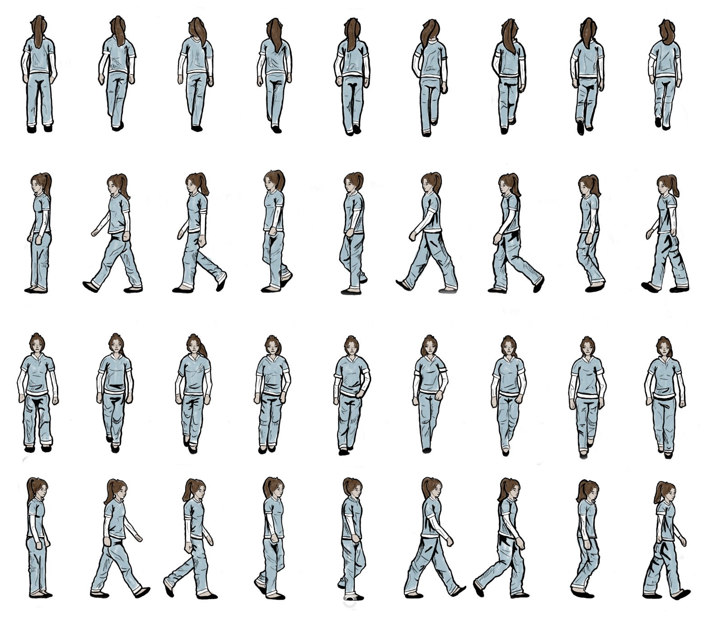

# CCL1

In Containment Protocol, you play as a nurse in a psychiatric ward who is experiencing a schizophrenic episode. Objects around you seem to disappear and reappear unpredictably, making it difficult to distinguish reality from hallucination. Your goal is to maintain control of your sanity by identifying what’s real and what’s not—until your shift ends.

Gameplay Overview: 
At the start of the game, you must memorize the initial room layout. Five objects will already be missing from the full map, and you need to take note of these—they should never appear later in the game.

Once the game begins, anomalies will start occurring after an alert. Every few seconds, an object will either:

0.	Appear out of nowhere
1.	 Disappear from the environment
2.	Stay unchanged

You move using the WASD keys and must carefully observe the room. If you notice an object that shouldn’t be there, press the "Object Appeared" button to revert it. If an object vanishes when it shouldn’t, press the "Object Disappeared" button.

Losing Conditions:
You can lose in two ways:

1.	Missed Anomalies – If more than three objects change without you detecting them, you lose.
2.	Incorrect Actions – If you press a button incorrectly (e.g., marking an object as disappeared when it hasn’t), you lose a life. Losing all lives ends the game.

Features:
•	Animations 
•	Objects appearing disappearing 
•	Buttons to detect appearing and disappearing objects  
•	Layout map cheat sheet 
•	In all directions movable character 
•	Collision detection 
•	Background audio 
•	Timer 
•	Lives count 
•	Start screen  
•	Win and lose screens 
•	Restart button 
•	Drawn objects
 
Controls: 
Up: W 
Left: A 
Down: S 
Right: D 
Click on: buttons 

Technologies: 
-	HTML5 Canvas
-	CSS basic styling
-	Java game logic and interactivity 

Images: 

The starting pasge:

Win lose screens:

map layout:

game snippet 2 diffarent times same round to show objects that have appeared and disappeared:

character sprite sheet:

